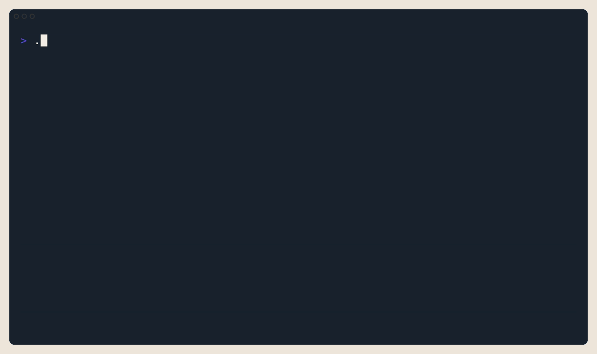

# Faultline

Faultline is a deterministic CLI for CI failure analysis.

Give it a failing build log and it returns the likeliest known failure pattern, the exact evidence that matched, and concrete fix and validation steps. It can also inspect a local repository for source-level failure risks and optionally correlate diagnoses with recent local git history.

Faultline is local-first, runs without network calls during analysis, and keeps ML or LLM systems out of the product path.



## Why it exists

CI failures are often repetitive, noisy, and slower to diagnose than they should be.

Faultline is built for engineers who want:

- deterministic results from explicit rules
- evidence pulled directly from the log
- fast local diagnosis without uploading build data
- stable terminal and JSON output for automation

It is intentionally narrow. Faultline does not try to explain every possible failure. It aims to be fast, repeatable, and trustworthy on failures it knows.

## What it does

- Analyze CI logs from a file or stdin.
- Inspect a repository for source-level failure risks.
- Render concise terminal, markdown, or stable JSON output.
- Generate deterministic follow-up workflows from the analysis result.

Common bundled diagnoses include Docker registry auth failures, missing executables, runtime mismatches, dependency drift, network failures, and common CI environment problems.

## Quickstart

### Release archive

```bash
VERSION=v0.1.0
curl -L "https://github.com/faultline-cli/faultline/releases/download/${VERSION}/faultline_${VERSION}_linux_amd64.tar.gz" -o faultline.tar.gz
tar -xzf faultline.tar.gz
cd "faultline_${VERSION}_linux_amd64"
./faultline analyze examples/docker-auth.log
```

### Build from source

Requires Go 1.25+.

```bash
make build
./bin/faultline analyze examples/docker-auth.log
```

### Docker

```bash
docker build -t faultline .
docker run --rm -v "$(pwd)":/workspace faultline analyze /workspace/examples/docker-auth.log
```

## First run

The repository includes runnable examples and expected markdown output.

```bash
./bin/faultline analyze examples/docker-auth.log
./bin/faultline analyze examples/docker-auth.log --format markdown
./bin/faultline fix examples/docker-auth.log --format markdown
./bin/faultline explain docker-auth
```

Expected markdown output for the Docker auth example starts like this:

```md
# Docker registry authentication failure

- ID: `docker-auth`
- Confidence: 33%
- Category: auth
- Severity: high
```

More runnable examples are documented in `examples/README.md`.

## Core commands

| Command | Purpose |
| --- | --- |
| `analyze [file]` | Diagnose a CI log from a file or stdin |
| `fix [file]` | Print fix steps for the top diagnosis |
| `inspect [path]` | Scan a repository for source-level findings |
| `explain <id>` | Show the full playbook for one diagnosis |
| `list` | List bundled and installed playbooks |
| `workflow [file]` | Generate a deterministic follow-up workflow |
| `packs` | Install and manage optional extra playbook packs |
| `completion` | Generate shell completion scripts |

Useful flags:

| Flag | Description |
| --- | --- |
| `--json` | Emit machine-readable JSON |
| `--format terminal\|markdown\|json` | Choose the output format |
| `--mode quick\|detailed` | Control human-readable output detail |
| `--top N` | Show the top N ranked diagnoses |
| `--git` | Enrich analysis with recent local git context |
| `--repo <path>` | Choose the repository used by `--git` |

## How it works

1. Faultline normalizes the input log into stable lines.
2. It loads deterministic YAML playbooks from the bundled catalog and any optional installed packs.
3. It matches explicit patterns, ranks results with stable rules, and extracts supporting evidence.
4. It returns a diagnosis, evidence, fix steps, and validation guidance.

The same input and playbook set should produce the same result every time.

## Credibility checks

- `./bin/faultline fixtures stats` currently reports 112 accepted real fixtures.
- The checked-in regression snapshot reports top-1 = 1.000, top-3 = 1.000, unmatched = 0.000, false_positive = 0.000.
- The bundled catalog currently ships 67 playbooks under `playbooks/bundled/`.
- Release validation runs `make test`, `make review`, `make fixture-check`, release archive smoke tests, and Docker smoke tests.

These numbers describe the checked-in regression corpus, not the full space of CI failures.

## Repository guide

- `examples/README.md` shows runnable sample logs and expected output.
- `docs/architecture.md` explains package boundaries and runtime flow.
- `docs/playbooks.md` documents playbook authoring and pack composition.
- `docs/distribution.md` covers release and Docker packaging.
- `docs/detectors.md` describes detector behavior.
- `docs/adr/README.md` indexes architectural decisions.
- `CONTRIBUTING.md` covers contribution and fixture-sanitization rules.

## Development

```bash
make build
make test
make review
make demo-assets
```

`make demo-assets` regenerates the README GIFs and screenshots from the VHS tapes under `docs/readme-assets/tapes/`.

## Feedback

The most useful issue is a sanitized CI failure that Faultline should diagnose better. Include the smallest log excerpt that reproduces the problem, the expected diagnosis, and what Faultline returned instead.

Raw ingestion artifacts belong in `fixtures/staging/` only as a local review queue. Sanitize them before promotion into `fixtures/real/`.

## License

Faultline is licensed under MIT. See `LICENSE`.


