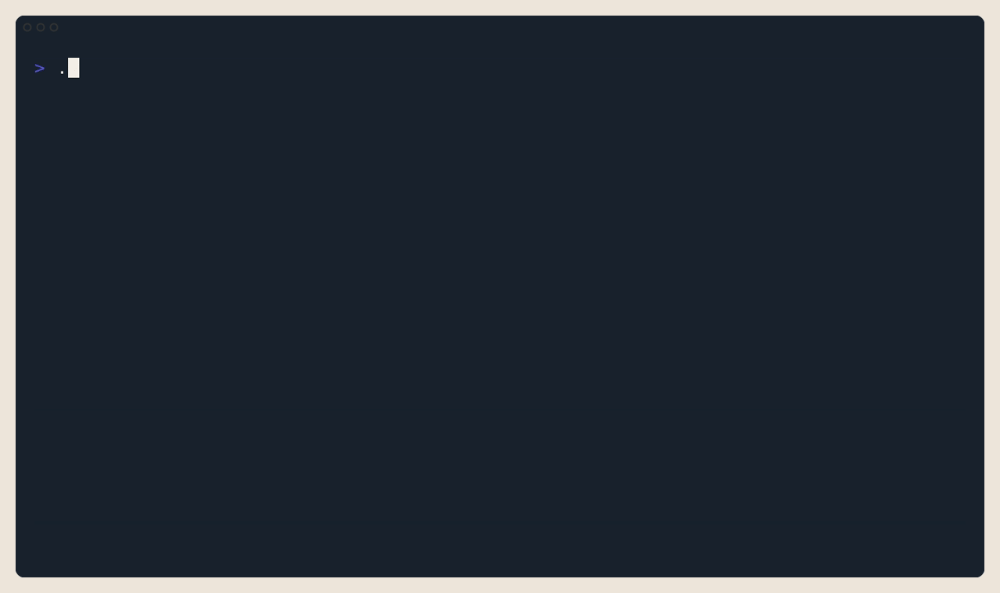

# Faultline

[](https://github.com/faultline-cli/faultline/actions/workflows/ci.yml) [](docs/playbooks.md) [](docs/fixture-corpus.md) [](docs/fixture-corpus.md) [](https://github.com/faultline-cli/faultline/actions/workflows/ci.yml) [](docs/fixture-corpus.md#large-scale-real-world-evaluation)

Stop spelunking CI logs. Point Faultline at the failure and get the diagnosis.

Faultline is a deterministic diagnosis engine for CI failures. It matches your failing build log against an explicit, versioned catalog of 193 playbooks and returns evidence-backed diagnoses — the exact matched lines, the root cause, and the fix. No AI. No guesswork. Same log in, same result out.

**Your build just failed. Here's what the next 30 seconds looks like:**

```text
# build.log contains:
exec /__e/node20/bin/node: no such file or directory
```

```text
$ faultline analyze build.log

[1] missing-executable (confidence: 84%)
Evidence:
  - exec /__e/node20/bin/node: no such file or directory

Fix:
  - Install the missing runtime in the CI image
  - Pin the runner to an image that includes the expected binary
```

No digging through 2,000 lines of output. No asking an LLM to guess.
The diagnosis is backed by matched evidence, sourced from an inspectable playbook, and stable enough to pipe into automation.

**v0.4.4** — 193 bundled playbooks · 228 real fixtures · checked-in baseline top-1/top-3: 0.921 · unmatched: 0.079 · weak-match: 0.000 · false-positive: 0.000 · **89.4% match on 30,094 real-world GitHub Actions logs**

## ⚡ Install

One command. Works locally and in CI.

```bash
curl -fsSL https://raw.githubusercontent.com/faultline-cli/faultline/main/install.sh | sh
faultline analyze build.log
```

## ⚙ How it works

1. **Analyze** — match the failing log against 193 bundled playbooks, extract evidence lines, score and rank candidates
2. **Diagnose** — return the top match with confidence, the exact evidence, and concrete fix steps
3. **Handoff** — optionally emit a stable JSON artifact for your automation, agent, or post-mortem tool

```bash
faultline analyze build.log                    # human-readable: evidence, root cause, fix
faultline analyze build.log --json             # same diagnosis as stable machine-readable JSON
faultline workflow build.log --json --mode agent  # deterministic handoff for automation
faultline list                                 # browse the full versioned catalog
faultline explain <failure-id>                 # deep-dive on a single failure pattern
faultline fix build.log                        # print remediation steps, nothing else
```

Determinism is the contract, not a feature flag. By default, the same log and playbook set produce the same output every time, which means you can diff it, store it, replay it, and build on top of it.

## 🔍 What it catches

193 playbooks covering the failures that actually break builds in production CI.

**Validated at scale:** 89.4% match rate on 30,094 real-world GitHub Actions failure logs collected from public repositories in early 2026. The top 20 matched failure classes cover 74% of all matched cases, with `container-crash`, `eslint-failure`, `buildkit-session-lost`, `ignored-exit-code`, and `pnpm-lockfile` alone accounting for over 50%. See [docs/fixture-corpus.md](docs/fixture-corpus.md#large-scale-real-world-evaluation) for full results.

| Category | Examples |
|---|---|
| ⚙ Runtime & executables | Missing binaries, PATH failures, node/python/ruby/go version mismatches, OOM kills, encoding errors |
| 📦 Dependencies | npm/yarn/pnpm lockfile drift, Maven/Gradle resolution, dotnet restore, yanked packages, registry outages |
| 🏗 Infrastructure | Docker auth, registry errors, entrypoint misconfiguration, volume mounts, multi-stage artifact paths |
| 🧪 Test runners | pytest fixture errors, jest worker crashes, testcontainer startup failures, timezone/clock drift, non-deterministic seeds |
| 🔒 Access & network | Permission denied, DNS failures, TLS errors, proxy misconfiguration, IPv6/IPv4 resolution, expired credentials |
| 🌐 IaC | terraform init, state lock, provider auth, base image breaking changes, Alpine/Debian incompatibility |
| 🔧 Build tooling | CRLF line endings, config schema errors, formatting checks, CLI flag changes, sh vs bash compatibility |
| 🔄 CI workflow | Workflow not triggered, steps silently skipped, orphaned runner resources, git submodule init, remote cache misses |

Faultline is intentionally narrow: precise on failures it knows, silent on failures it doesn't. No hallucinated diagnoses.

### Silent / misleading failures

Faultline detects a class of failure most tools miss: **CI appeared to succeed, but important work never happened**.

```bash
faultline analyze build.log --fail-on-silent
```

Eight built-in detectors cover suppressed exit codes, zero-test runs, missing artifacts, cache failures, skipped critical steps, empty deploy targets, and empty lint/scan steps. See [docs/silent-failures.md](docs/silent-failures.md) for details.

## ↪ Drop it into CI

The fastest path is the official GitHub Action — one step, no install wiring:

```yaml
- name: Diagnose failure
  if: failure()
  uses: faultline-cli/action@v1
  with:
    log: build.log
```

That's it. Faultline installs itself, analyzes the log, writes the diagnosis to the job summary, and uploads JSON artifacts automatically.

**Key inputs:**

| Input | Default | Purpose |
|-------|---------|--------|
| `log` | _(required)_ | Path to the failing build log file |
| `version` | `latest` | Pin a specific release, e.g. `v0.4.4` |
| `format` | `markdown` | Output format: `text` or `markdown` |
| `annotations` | `false` | Emit native GitHub CI annotations |
| `json` | `true` | Produce a machine-readable JSON artifact |
| `workflow` | `true` | Produce a `workflow.v1` handoff artifact |
| `fail-on-silent` | `false` | Fail if silent failure detectors fire |
| `upload-artifacts` | `true` | Upload JSON and markdown as workflow artifacts |
| `job-summary` | `true` | Append the diagnosis to the job summary |
| `delta` | `false` | Experimental delta analysis vs. last passing run |
| `github-token` | `` | Required when `delta: true` |

**Key outputs:** `failure-id`, `summary-markdown`, `analysis-json`, `workflow-json`

Gate a follow-up step on the matched failure:

```yaml
- name: Diagnose failure
  if: failure()
  id: diagnosis
  uses: faultline-cli/action@v1
  with:
    log: build.log

- name: Open remediation issue
  if: failure() && steps.diagnosis.outputs.failure-id != ''
  run: echo "Root cause: ${{ steps.diagnosis.outputs.failure-id }}"
```

For full input/output reference and usage examples, see the [action repository](https://github.com/faultline-cli/action) and the [GitHub Actions contract](docs/github-action-contract.md).

**Or install manually** if you need more control:

```yaml
- name: Diagnose failure
  if: failure()
  run: |
    VERSION=v0.4.4 curl -fsSL https://raw.githubusercontent.com/faultline-cli/faultline/main/install.sh | sh
    faultline analyze build.log --json > faultline-analysis.json
    faultline workflow build.log --json --mode agent > faultline-workflow.json
```

The JSON artifacts are stable across default runs. Local history enrichment is explicit: opt in with `--history`, `--store`, or `FAULTLINE_STORE`.
See the [GitHub Actions contract](docs/github-action-contract.md) and [GitLab CI contract](docs/gitlab-ci-contract.md) for full wrapper details.

## → Automation handoff

`faultline workflow` turns the winning diagnosis into a deterministic handoff artifact — ready to pass to a remediation agent, feed into a ticket, or attach to a post-mortem.

```json
{
  "schema_version": "workflow.v1",
  "mode": "agent",
  "failure_id": "missing-executable",
  "evidence": [
    "exec /__e/node20/bin/node: no such file or directory"
  ],
  "files": [
    "Dockerfile",
    ".github/workflows/ci.yml"
  ]
}
```

## ◆ What's new in v0.4.4

**Playbook inheritance in production, full ontology tagging, and six new playbooks.** The `node-missing-executable` playbook is the first bundled example of `extends`-based inheritance, with correct NativeAny scoring so children compete only on their own distinctive patterns. All 193 playbooks now carry full ontology fields (`domain`, `class`, `mode`, `tags`). Six new playbooks cover Maven compile errors, MSBuild failures, Cargo test failures, LDAP connection failures, HTTP auth failures, and Node.js-specific missing-executable diagnoses.

- **193 bundled playbooks** (+6 new: `maven-compile-error`, `msbuild-error`, `cargo-test-failure`, `ldap-connection-failure`, `http-auth-failure`, `node-missing-executable`)
- **First production use of playbook inheritance** — `node-missing-executable` extends `missing-executable` with Node-specific patterns and runner exclusions
- **NativeAny scoring** — child playbooks score only from their own distinctive `match.any` patterns; inherited patterns contribute to evidence but not to the child's score
- **Full ontology coverage** — all 193 playbooks tagged with `domain`, `class`, `mode`, and `tags`
- **Current checked-in real-fixture baseline** — top-1/top-3 0.921 (210/228), unmatched 0.079 (18/228), weak-match 0.000, false-positive 0.000
- **Published CI Go coverage** — 84.3% from the repository `go test ./... -coverprofile` workflow
- **13 new inheritance tests** in `internal/playbooks/inheritance_test.go`

Full release notes: [docs/releases/v0.4.4.md](docs/releases/v0.4.4.md)

## ◈ Free vs Team

**Core (free):** everything you need to diagnose failures fast, locally, with your logs staying on your machine.
`analyze` · `workflow` · `list` · `explain` · `fix`

**Team (paid):** built for orgs that want to track failure patterns over time.
Cross-run correlation, failure aggregation, policies, shared playbook repos, and reporting across teams.

Companion surfaces (`inspect`, `guard`, `trace`, `replay`, `compare`, `packs`) are supported but non-default. See [docs/release-boundary.md](docs/release-boundary.md).

## ▶ Try the examples

The repo ships with real failure logs and checked-in expected outputs. No CI log needed to kick the tires.

```bash
./bin/faultline analyze examples/missing-executable.log
./bin/faultline analyze examples/runtime-mismatch.log
./bin/faultline analyze examples/docker-auth.log
```



More samples and expected outputs: [examples/README.md](examples/README.md)

## More install options

<details>
<summary>Build from source, Docker, or release archive</summary>

Requires Go 1.25+ for source builds.

```bash
git clone https://github.com/faultline-cli/faultline
cd faultline
go build -o faultline ./cmd
./faultline analyze examples/missing-executable.log
```

```bash
docker build -t faultline .
docker run --rm -v "$(pwd)":/workspace faultline analyze /workspace/examples/missing-executable.log
```

```bash
VERSION=v0.4.4
curl -fL "https://github.com/faultline-cli/faultline/releases/download/${VERSION}/faultline_${VERSION}_linux_amd64.tar.gz" -o faultline.tar.gz
tar -xzf faultline.tar.gz
cd "faultline_${VERSION}_linux_amd64"
./faultline analyze build.log
```

</details>

## 📚 Learn more

- [examples/README.md](examples/README.md) — runnable sample logs and expected output snapshots
- [docs/failures/catalog/README.md](docs/failures/catalog/README.md) — crawlable failure catalog: all 193 playbooks with diagnosis, fix, and search phrases
- [docs/playbooks.md](docs/playbooks.md) — authoring playbooks, team extensions, and packs
- [docs/fixture-corpus.md](docs/fixture-corpus.md) — regression corpus and accuracy methodology
- [ROADMAP.md](ROADMAP.md) — what's coming next
- [docs/release-boundary.md](docs/release-boundary.md) — Core vs Team boundary detail

## 🛠 Development

```bash
make build
make test
make review
make cli-smoke
```

## 💬 Feedback

The most useful issue is a sanitized CI failure that Faultline should diagnose better. Include the smallest log excerpt that reproduces the problem, the expected diagnosis, and what Faultline returned instead.

## License

MIT. See `LICENSE`.
