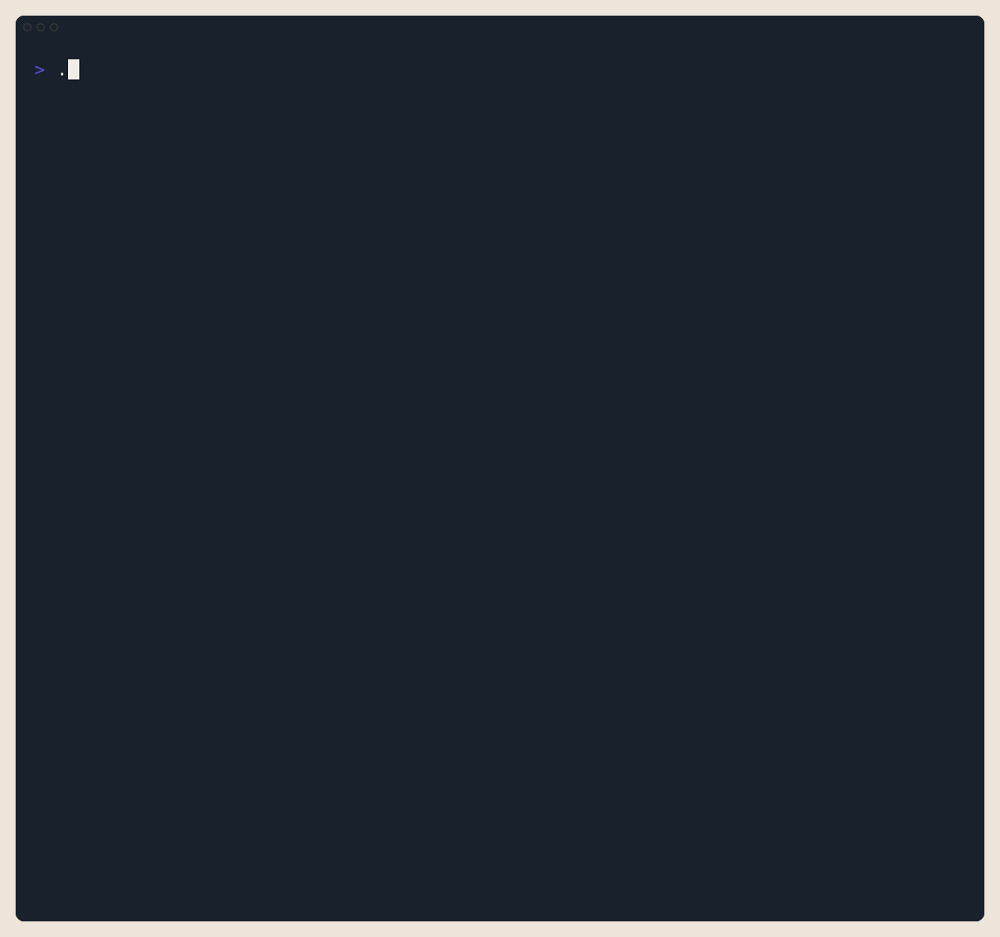
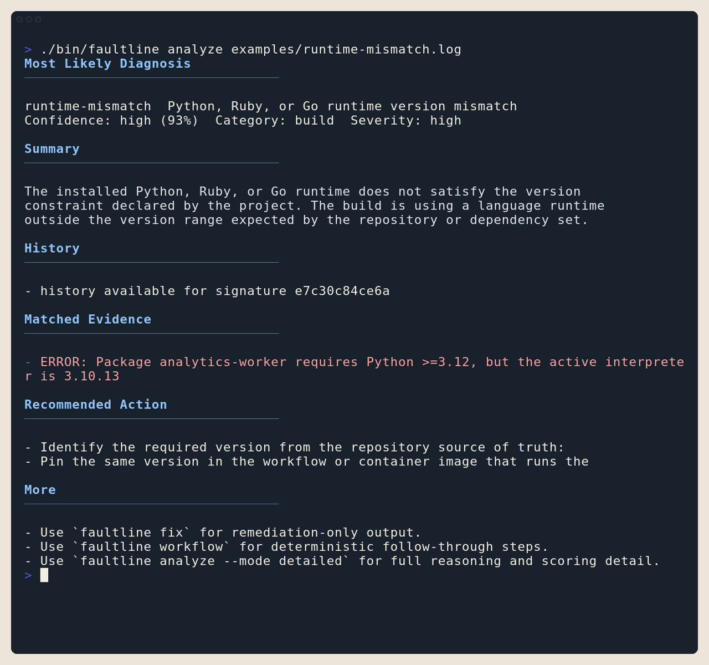
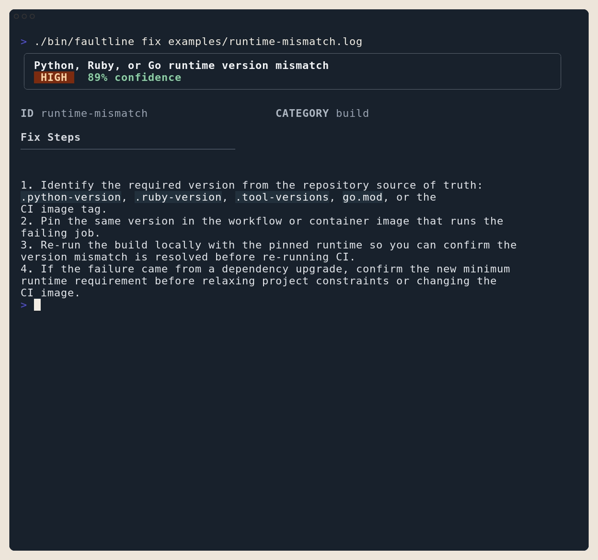
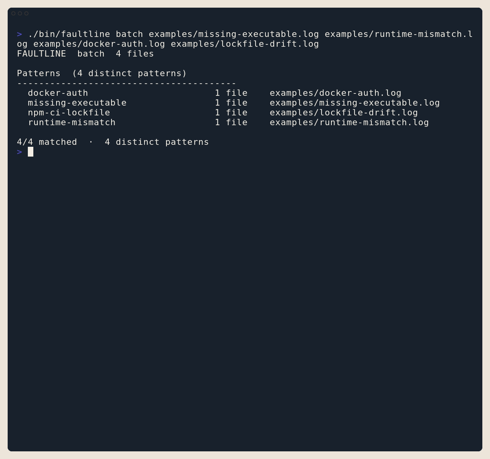

# Faultline

[](https://github.com/faultline-cli/faultline/actions/workflows/ci.yml)
[](https://github.com/faultline-cli/faultline/releases)
[](docs/fixture-corpus.md)
[](LICENSE)
[](docs/failures/catalog/README.md)

Faultline is a deterministic CLI for classifying CI build failures. Point it at a failing log and it returns the failure class, evidence lines copied from the log, and the fix path it can support; no AI, no external calls, no guessing. Same log in → same result out.

<p align="center">
  
</p>

- **Local-first** - runs entirely on your machine or CI runner. No LLM, no network calls, no service dependency.
- **Evidence-backed** - every diagnosis quotes the exact log lines that triggered the match, so humans and agents can verify it.
- **Stable output** - text, markdown, JSON, and workflow artifacts for tickets, CI steps, agent handoff, and postmortems.
- **182 bundled playbooks** covering runtime failures, dependency issues, Docker auth, test runners, IaC, and more.
- **89.4% match rate** across 30,094 real failed GitHub Actions logs.

## Install

```bash
curl -fsSL https://raw.githubusercontent.com/faultline-cli/faultline/main/install.sh | sh
```

## Quick start

Classify a failing log:

```bash
faultline analyze build.log
```

Try it without a log file; pipe in a single error line to see the full loop:

```bash
echo 'exec /__e/node20/bin/node: no such file or directory' | faultline analyze
```

<p align="center">
  
</p>

Get the fix steps for the matched failure:

```bash
faultline fix build.log
```

<p align="center">
  
</p>

Classify an entire failed pipeline in one pass:

```bash
faultline batch job-1.log job-2.log job-3.log job-4.log
```

<p align="center">
  
</p>

Emit JSON for CI, tickets, or agent handoff:

```bash
faultline analyze build.log --json
cat build.log | faultline analyze --json
faultline workflow build.log --json --mode agent
```

## How it works

Faultline is a known-pattern classifier, not an inference engine.

- It classifies failures it recognizes from explicit, versioned playbooks.
- It returns matched evidence from the log so the result can be checked.
- It is silent when the failure is unknown or evidence is too weak.
- AI, search, and debugging tools are still useful as the second step; after the log has been classified or left unmatched.

This makes Faultline useful before investigation starts: route the obvious failures, standardize known fixes, and avoid spending attention on classes the team already understands.

## Core commands

```bash
faultline analyze build.log                       # classify a log, show evidence and next action
faultline fix build.log                           # remediation steps for the top match
faultline workflow build.log --json --mode agent  # structured handoff for automation or agents
faultline batch job-1.log job-2.log --json        # classify multiple logs, grouped by pattern
faultline inspect .                               # run source detectors on the local tree
faultline list                                    # browse known failure classes
faultline explain missing-executable              # inspect one failure class
```

- `analyze` - classify a failing log and show evidence, diagnosis, and next action.
- `fix` - print the remediation steps for the top diagnosis.
- `workflow` - generate deterministic follow-through output for automation or handoff.
- `batch` - classify several logs and group results by failure pattern.
- `inspect` - scan the local source tree with deterministic source detectors.
- `list` - browse known failure classes.
- `explain` - inspect one failure class before trusting or changing it.

`report` exists as a bounded local companion for the forensic store created by prior local runs; cross-repo recurrence and coordination belong to the Team layer.

## What to trust

Faultline output is designed to be inspectable.

- `failure_id` is the stable class name.
- `evidence` is copied from the input log.
- `confidence` reflects rule strength, not certainty about your whole system.
- `faultline explain <failure-id>` shows the diagnosis, fix guidance, and matching rules for that class.
- `--json` returns the same classification in a machine-readable artifact for CI, agents, tickets, or postmortems.

Unknown output is not a failure of the CLI contract. If the log does not match a known class, Faultline stays silent rather than inventing a diagnosis.

## JSON output

`--json` returns stable, automatable fields:

```json
{
  "matched": true,
  "faultline_status": "failure",
  "results": [
    {
      "rank": 1,
      "failure_id": "runtime-mismatch",
      "confidence": 0.93,
      "evidence": [
        "ERROR: Package analytics-worker requires Python >=3.12, but the active interpreter is 3.10.13"
      ]
    }
  ]
}
```

## What it catches

Faultline ships with 182 bundled playbooks for common CI failure classes.

| Category | Examples |
| --- | --- |
| Runtime and executables | missing binaries, PATH failures, runtime version mismatches, OOM kills |
| Dependencies | npm/yarn/pnpm lockfile drift, Maven/Gradle restore failures, missing modules, registry errors |
| Containers and infrastructure | Docker auth, image pull failures, entrypoint errors, volume and artifact path issues |
| Test runners | pytest, jest, Go test, cargo test, flaky tests, timeouts, zero-test runs |
| Access and network | permission denied, DNS failures, TLS errors, proxy issues, expired credentials |
| CI workflow | skipped steps, ignored exit codes, missing artifacts, cache misses, shallow checkout, submodules |
| Build tooling | formatting gates, TypeScript and compiler errors, shell compatibility, config schema errors |
| IaC and deploy | Terraform init/state/provider failures, Kubernetes rollout errors, health check failures |

Use `faultline list` to browse the full catalog and `faultline explain <failure-id>` to see how a class is matched. The full catalog is at [docs/failures/catalog/README.md](docs/failures/catalog/README.md).

## CI use

Capture the failing command's output to a file first:

```yaml
- name: Run tests
  run: |
    set -o pipefail
    make test 2>&1 | tee build.log
```

Then run Faultline in a failure-only step:

```yaml
- name: Diagnose failure
  if: failure()
  uses: faultline-cli/action@v1
  with:
    log: build.log
```

Or install the binary directly:

```yaml
- name: Diagnose failure
  if: failure()
  run: |
    curl -fsSL https://raw.githubusercontent.com/faultline-cli/faultline/main/install.sh | sh
    faultline analyze build.log --json > faultline-analysis.json
    faultline workflow build.log --json --mode agent > faultline-workflow.json
```

See the [GitHub Actions contract](docs/github-action-contract.md) and [GitLab CI contract](docs/gitlab-ci-contract.md) for wrapper details.

## Recurring failures

`faultline analyze` records matched-failure metadata in a local forensic store. After repeated local or CI runs:

```bash
faultline report                        # group stored runs by failure class
faultline analyze build.log --history   # add local recurrence context to current output
```

- `report` shows which known failures keep recurring, making it easy to find classes worth standardizing.
- `--history` adds explicit recurrence context to the current analysis output.

This local memory is single-repo. Cross-repo aggregation, ownership-aware recurrence, and team coordination belong to the Team layer documented in [docs/release-boundary.md](docs/release-boundary.md).

## Team operating loop

Faultline Core answers local diagnosis questions: what failed, what evidence supports that classification, and what fix path is known.

1. Classify with `faultline analyze build.log`, or group several job logs with `faultline batch`.
2. Use `failure_id` as the stable label in tickets, incident notes, and postmortems.
3. Paste markdown or JSON output into the handoff so evidence and fix path travel together.
4. Run `faultline workflow build.log --json --mode agent` when a human or agent needs likely files, reproduction steps, and remediation context.
5. Run `faultline report` to pick the repeated classes worth standardizing.
6. When a missed or weak diagnosis keeps recurring, submit a sanitized fixture or add a playbook.

## Metrics

Faultline optimizes for precision over broad coverage.

| | |
|---|---|
| Bundled playbooks | 182 |
| Accepted real fixtures | 215 |
| Fixture top-1 baseline pass rate | 100% (215/215) |
| Fixture false positives | 0 |
| Weak matches | 0 |
| Large-scale evaluation match rate | 89.4% of 30,094 failed GitHub Actions logs |

The 89.4% figure is a match-rate claim, not a claim that every match was manually verified as the correct diagnosis. Silence is correct when evidence is unknown, ambiguous, or below the classifier threshold.

Details: [docs/fixture-corpus.md](docs/fixture-corpus.md).

## Install options

**Script (recommended):**

```bash
curl -fsSL https://raw.githubusercontent.com/faultline-cli/faultline/main/install.sh | sh
```

**Pre-built binary:**

```bash
VERSION=v0.5.0
curl -fL "https://github.com/faultline-cli/faultline/releases/download/${VERSION}/faultline_${VERSION}_linux_amd64.tar.gz" -o faultline.tar.gz
tar -xzf faultline.tar.gz
cd "faultline_${VERSION}_linux_amd64"
./faultline analyze build.log
```

**Docker:**

```bash
docker build -t faultline .
docker run --rm -v "$(pwd)":/workspace faultline analyze /workspace/build.log
```

**From source** (requires Go 1.25+):

```bash
git clone https://github.com/faultline-cli/faultline
cd faultline
go build -o faultline ./cmd
./faultline analyze examples/missing-executable.log
```

## Submit a failure

The most useful contribution is a real CI failure that Faultline missed, misclassified, or explained weakly.

Open a [missed failure issue](https://github.com/faultline-cli/faultline/issues/new?template=missed_failure.md) with:

- the CI provider
- the smallest sanitized log excerpt that reproduces the result
- the diagnosis or fix path you expected
- the exact Faultline output
- optional reproduction steps or a public build link when safe to share

Do not include secrets, tokens, signed URLs, private hostnames, customer names, or unsanitized internal repository data.

For code changes:

```bash
make build
make test
make fixture-check
make review
make docs-check
make cli-smoke
```

Use [docs/playbooks.md](docs/playbooks.md) for playbook authoring and [docs/fixture-corpus.md](docs/fixture-corpus.md) for corpus expectations.

## FAQ

**Does Faultline send my logs anywhere?**
No. Analysis runs entirely on your machine or inside your CI runner. No log data, telemetry, or output is transmitted to any external service. The only network activity is the optional `--git` flag, which reads your local `.git` directory - not the internet.

**What CI providers does it support?**
Any provider that produces a text log file: GitHub Actions, GitLab CI, CircleCI, Jenkins, Buildkite, Drone, Bitbucket Pipelines, and self-hosted runners. Faultline reads the log file; it has no provider-specific API dependency.

**Does it work with AI coding agents?**
Yes. `--json` and `--mode agent` output are designed for agent handoff. The `workflow` command returns structured diagnosis, likely files, reproduction steps, and remediation context in a stable JSON shape that agents can consume directly.

**How does it differ from just grepping the log?**
Faultline applies scored evidence rules against the full log, not a single line match. It normalizes multi-line patterns, ranks competing hypotheses, filters low-confidence matches, and returns a stable `failure_id` that travels cleanly into tickets, postmortems, and automation. `faultline explain <failure-id>` shows the full reasoning behind the classification.

**What if my failure isn't recognized?**
Faultline stays quiet rather than guessing. If you see a recurring unmatched failure, open a [missed failure issue](https://github.com/faultline-cli/faultline/issues/new?template=missed_failure.md) with a sanitized log excerpt. The playbook authoring guide is in [docs/playbooks.md](docs/playbooks.md).

**Can I add custom failure patterns for my team?**
Yes. Pass one or more local pack directories with `--playbook-pack` when you need deterministic local catalog composition. Persistent installed-pack management is intentionally outside the default product surface.

**How do I integrate it in a GitHub Actions workflow?**
Use the [`faultline-cli/action`](https://github.com/faultline-cli/action) wrapper on a failure-only step, or install the binary directly. Full contract in [docs/github-action-contract.md](docs/github-action-contract.md).

**What is the performance overhead?**
Faultline is a statically compiled Go binary with no runtime dependencies. Typical analysis of a 10,000 line CI log completes in well under one second.

## License

MIT. See [LICENSE](LICENSE).
